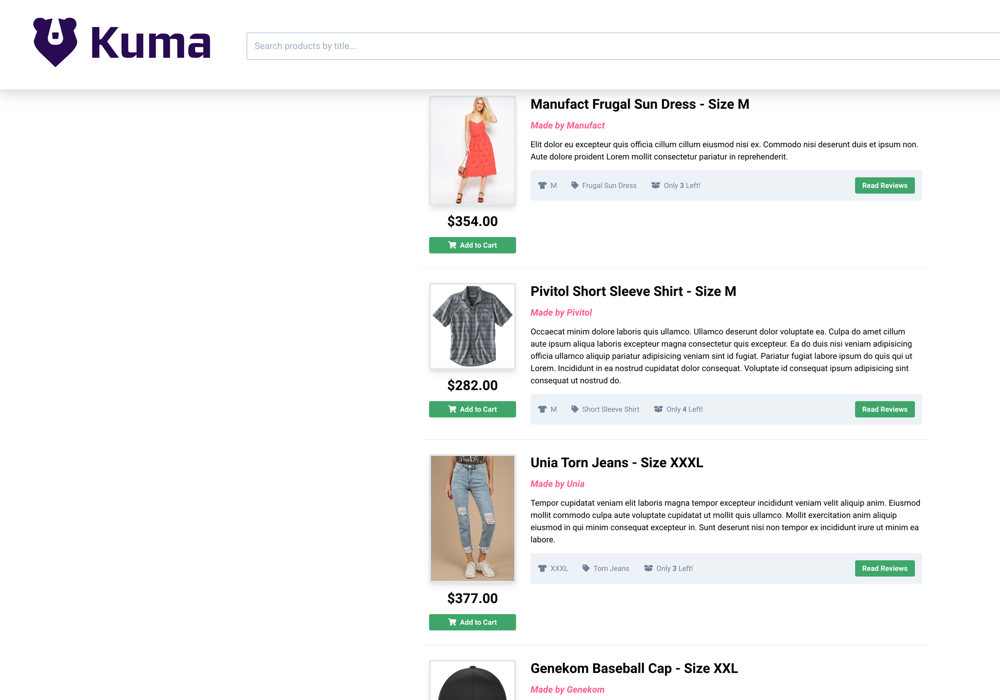
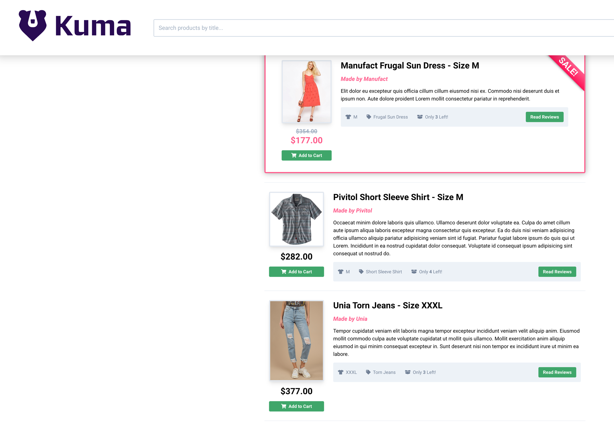

# GAMMA support in Kuma

A demo inspired by the [GAMMA](https://konghq.com/blog/engineering/gamma-and-kuma) blogpost to show how Kuma supports GAMMA.

## Prerequisite

- Helm installed
- Kubectl installed and configured to connect to running kubernetes cluster
- Kumactl installed and in the path [docs](https://kuma.io/docs/latest/production/install-kumactl)

## Run the demo

Start kuma and run the demo as needed:
```shell
./setup.sh
```

You can check things are running by doing:

```shell
kubectl port-forward -n kuma-demo svc/frontend 8080:8080
```

and going to your browser, you should see a market place:



Now we're going to install a [`HTTPRoute`](https://gateway-api.sigs.k8s.io/guides/http-routing/):

```shell
kubectl apply -f gamma-routes.yaml
```

If you port-forward again and check the UI nothing has changed.

Let's now shift the traffic to other backend:

```shell
kubectl patch -n kuma-demo httproute enable-sales-backend --type json -p '[
  {
    "op": "replace",
    "path": "/spec/rules/0/backendRefs/0/weight",
    "value": 0
  },
  {
    "op": "replace",
    "path": "/spec/rules/0/backendRefs/1/weight",
    "value": 1
  },
]
'
```

You should now see the first item as on sale:




Let's now set it up so we send traffic to either service with the same probability:

```shell
kubectl patch -n kuma-demo httproute enable-sales-backend --type json -p '[
  {
    "op": "replace",
    "path": "/spec/rules/0/backendRefs/0/weight",
    "value": 1
  },
  {
    "op": "replace",
    "path": "/spec/rules/0/backendRefs/1/weight",
    "value": 1
  },
]
'
```

If you go back to the website and load the page multiple times you'll see each version alternate.


That's it you've used Kuma without doing anything specific to Kuma that's the promise of the GAMMA effort.

TIP:
If you are curious you can see the underlying Kuma MeshHTTPRoute that was created by doing: 
```yaml
kubectl get meshhttproute -n kuma-system -oyaml
```
