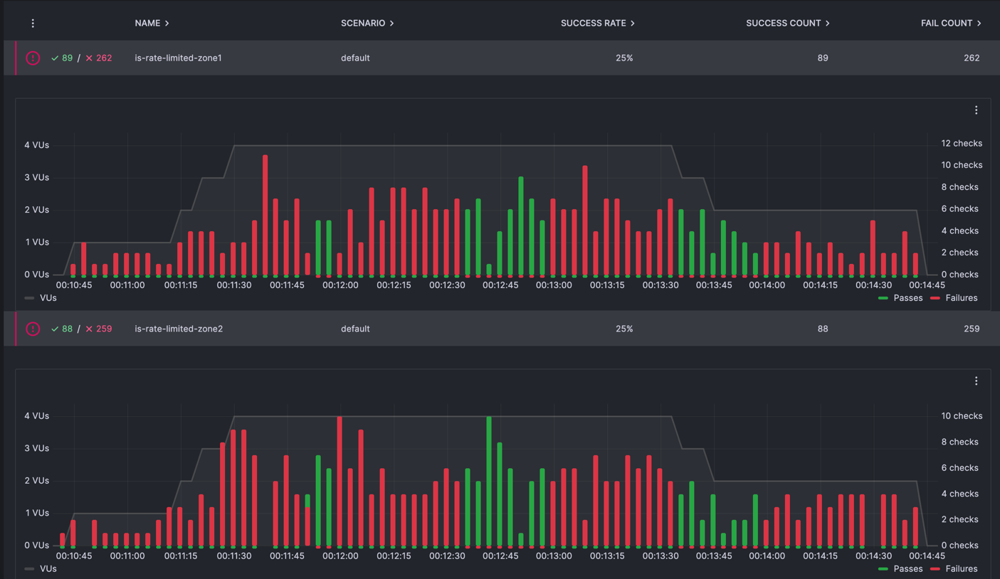

# Mesh Global Rate limit

A demo inspired by [The Mesh Global Rate limit blog post](https://konghq.com/blog/product-releases/mesh-global-rate-limit-policy)

## Prerequisite

- A Mesh Konnect account with a vcp
- A redis instance accessible from both kubernetes cluster 
- 2 Kubernetes cluster

## What we'll do

### Run a zone in each kubernetes cluster

Follow the Konnect add zone instructions (you can put the secret in `.secrets/zone{1,2}.yaml` and update the `values` files in this folder) 

### Install a simple HTTP echo in each zone and a gateway

Run `kubectl apply -f k8s-manifest.yaml` in each kubernetes cluster

### Add Kuma policies

Run `kumactl apply -f policies.yaml` against your global control plane.

This creates:

- A `MeshGateway` and a `MeshGatewayRoute` for the gateway
- A `MeshGlobalRateLimit` policy

### Retrieve the ip for each gateway

In each k8s cluster execute: `kubectl get svc -n kuma-test edge-gateway` and retrieve the `EXTERNAL-IP`

### Run test in k6

You can use grafana cloud or something else. Simply update the `k6-script.js` with the correct ips.

You'll get output similar too:

Green bar indicate that we're rate limiting. You can see that it happens in both zones at the same time.
We can see that we're globally rate limiting at a little over 2 requests per second.
