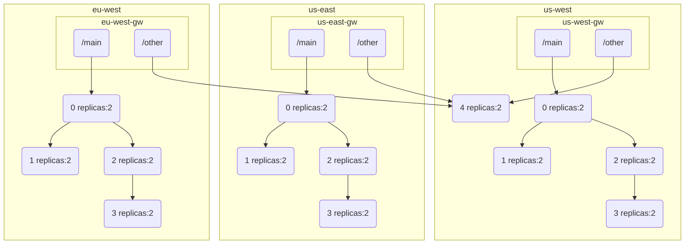
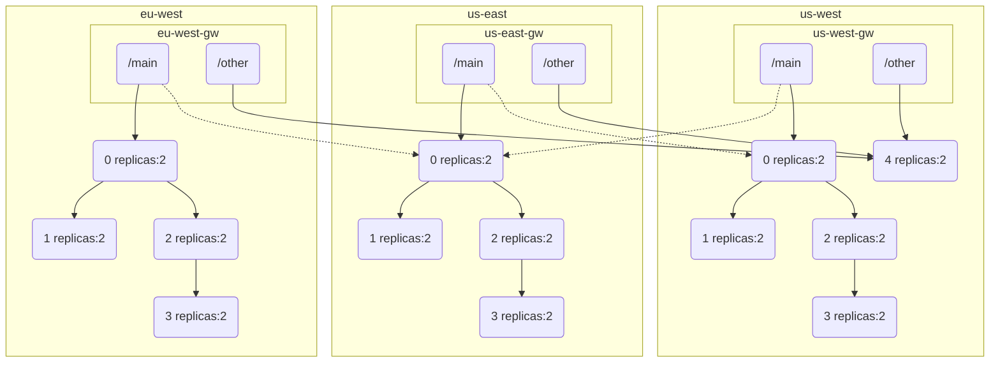

# Locality Aware


## Reload otel after a change

```shell
for i in us-east us-west europe-west; do
  kubectl config use-context gke_team-mesh_${i}1-c_user-call-${i};
  kubectl apply -f k8s/otel-collectors.yaml
  kubectl rollout restart -n observability deployment/otel-collector
done
```

## Delete clusters

```shell
for i in us-east us-west europe-west; do
  printf 'yes' | gcloud container clusters delete user-call-${i} --region ${i}1-c --async
done
```

## Get all ingress ips

```shell
for i in us-east us-west europe-west; do
  kubectl config use-context gke_team-mesh_${i}1-c_user-call-${i};
  echo ${i}=$(kubectl get svc -n microservice-mesh edge-gateway -o jsonpath='{.status.loadBalancer.ingress[0].ip}')
done
```

## Make default mesh

```shell
kumactl delete traffic-permission allow-all-default
kumactl delete traffic-route route-all-default
kumactl delete circuit-breaker circuit-breaker-all-default
kumactl delete retry retry-all-default
kumactl delete timeout timeout-all-default
```

## Make all errors to an endpoint fail 


```shell
./change api-play-000 break
```

And to repair:

```shell
./change api-play-000 heal
```


Or picking a random pod (edit the app label selector):

```shell
kubectl debug -n microservice-mesh $(kubectl get pods -n microservice-mesh -l app=api-play-000 -o name | head -1)  -it --image=nicolaka/netshoot -- /bin/bash -c 'curl localhost:8080/api/dynamic | jq ".apis[0].conf | .statuses=[{\"code\": \"500\", \"ratio\": 100000}]" | curl -v localhost:8080/api/dynamic/microservice_mesh  --data-binary @- -H "Content-Type: application/json"'
```

# Evolution

## Default state



We can see there is no failover, when traffic fails it stays in the zone.

## v0

Once we add failover on the gateway with

```shell
kumactl apply -f policies/v0.yaml
```

We can see gateway fails from one zone to the other but never to the third zone.




## Scenario

With everything started
Add background load to each zone

Show the setup, show the stats (everything stays in the same zone except api-play-004)

Break api-play-000 to start returning error in one zone.

See gateway stats return 500s

Add the locality aware stuff

See the other zone requests go up
