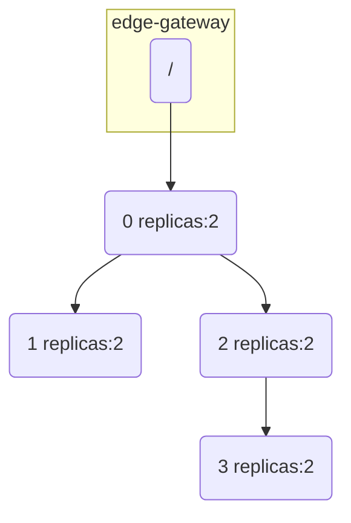

# Mesh Single Zone to Konnect

In this demo we start with a single zone Kuma CP and then move it to Konnect.
This demo was originally done in a user call available on [YouTube](https://www.youtube.com/watch?v=_CpM7xVWiZM).

## Prerequesite

- A running kubernetes cluster
  - (On GKE for example: `gcloud container clusters create user-call-konnect --num-nodes=3 --zone europe-west1-c --machine-type n1-standard-4; gcloud container clusters get-credentials user-call-konnect --region europe-west1-c`)
- Helm installed

## Run a single-zone setup

### Start Kong-Mesh
Follow the beginning of https://docs.konghq.com/mesh/2.6.x/quickstart/kubernetes-demo/ or simply do:
```shell
helm repo add kong https://charts.konghq.com
helm repo update
kubectl create namespace kong-mesh-system
kubectl create secret generic kong-mesh-license -n kong-mesh-system --from-file=.secrets/license.json
helm install -f values.yaml --namespace kong-mesh-system kong-mesh kong-mesh/kong-mesh
```

### Delete the default policies

```shel
kubectl delete meshcircuitbreaker mesh-circuit-breaker-all-default -n kong-mesh-system
kubectl delete meshtimeout mesh-gateways-timeout-all-default -n kong-mesh-system
kubectl delete meshtimeout mesh-timeout-all-default -n kong-mesh-system
kubectl delete meshretry mesh-retry-all-default -n kong-mesh-system
```

### Install our example setup

```shell
kubectl apply -f workload.yaml
```

This builds the following setup:



### Check connectivity

Retrieve the public IP to the gateway:

```shell
export PROXY_IP=$(kubectl get svc --namespace microservice-mesh edge-gateway -o jsonpath='{.status.loadBalancer.ingress[0].ip}')
echo $PROXY_IP
```

Call the gateway:

```shell
curl -s http://$PROXY_IP/ | jq .
```

We get an output similar to:

```json
{
  "body": "I am Service 0 and I have 2 replicas",
  "calls": [
    {
      "body": "{\"body\":\"I am Service 1 and I have 2 replicas\",\"calls\":null,\"latency_millis\":0,\"status\":200}\n",
      "status": 200,
      "url": "http://api-play-001.microservice-mesh.svc.8080.mesh:80/api/dynamic/microservice_mesh"
    },
    {
      "body": "{\"body\":\"I am Service 2 and I have 2 replicas\",\"calls\":[{\"body\":\"{\\\"body\\\":\\\"I am Service 3 and I have 2 replicas\\\",\\\"calls\\\":null,\\\"latency_millis\\\":0,\\\"status\\\":200}\\n\",\"status\":200,\"url\":\"http://api-play-003.microservice-mesh.svc.8080.mesh:80/api/dynamic/microservice_mesh\"}],\"latency_millis\":0,\"status\":200}\n",
      "status": 200,
      "url": "http://api-play-002.microservice-mesh.svc.8080.mesh:80/api/dynamic/microservice_mesh"
    }
  ],
  "latency_millis": 0,
  "status": 200
}
```

We can see everything works as expected

## Connect our zone to Konnect

### Get kumactl

```shell
curl https://docs.konghq.com/mesh/installer.sh | sh -
export PATH=$PATH:`pwd`/kong-mesh-2.6.0/bin
```

### Export state

In a window port-forward to the CP api:

```shell
kubectl port-forward -n kong-mesh-system svc/kong-mesh-control-plane 5681:5681
```

And in another window export all policies:

```shell
kumactl config control-planes switch --name=local
kumactl export --profile=federation --format=universal > resources.yaml
```

### Create CP on Konnect

Go to: https://cloud.konghq.com/us/mesh-manager/ and create a control-plane

Once this is done and you've configured kumactl to communicate with the CP with something like:

```shell
kumactl config control-planes add \
  --address https://us.api.konghq.com/v0/mesh/control-planes/<CPID>/api \
  --name "konnect_<CPNAME>" \
  --headers "authorization=Bearer $KONNECT_TOKEN"
```

Delete the default mesh policies:
```shell
kumactl delete meshcircuitbreaker mesh-circuit-breaker-all-default
kumactl delete meshtimeout mesh-gateways-timeout-all-default
kumactl delete meshtimeout mesh-timeout-all-default
kumactl delete meshretry mesh-retry-all-default
kumactl delete traffic-permission allow-all-default
kumactl delete traffic-route route-all-default
```

Apply the exported resources:

```shell
kumactl apply -f resources.yaml
```

### Restart our CP and Konnect to the global CP

Go a click create zone and only take the secret and the values file save it to `values-konnect.yaml`.

Update your control-plane with:

```shell
helm upgrade -n kong-mesh-system kong-mesh kong-mesh/kong-mesh -f values-konnect.yaml
```

## Play with MeshTimeout policy

### Add latency to svc-000:

```shell
kubectl edit configmap -n microservice-mesh api-play-000
```

add: `"latency": {"min_millis": 1000, "max_millis": 2000},` 

see it's longer: `curl -s http://$PROXY_IP/`

### Apply a timeout that applies to all DPPs

```shell
kubectl apply -f timeout-1.yaml
```

- See it fail: `curl -s http://$PROXY_IP/`
- Apply the timeout to fix it `kubectl apply -f timeout-2.yaml`
- See it work: `curl -s http://$PROXY_IP/`
- Look at the GUI

### Now more latency to svc-003!

```shell
kubectl edit configmap -n microservice-mesh api-play-003
```

add: `"latency": {"min_millis": 1000, "max_millis": 2000},`

see it fails: `curl -s http://$PROXY_IP/`

### Try to fix it

- Apply the timeout to fix it `kubectl apply -f timeout-3.yaml`
- See it still fails: `curl -s http://$PROXY_IP/`

It's because svc-000 doesn't talk directly to svc-003 we need to add 2 timeouts one from svc-000 to svc-002 and one from svc-002 to svc-003

- Apply the timeout to fix it `kubectl apply -f timeout-3-fixed.yaml`
- See it work: `curl -s http://$PROXY_IP/`
- Look at the GUI
